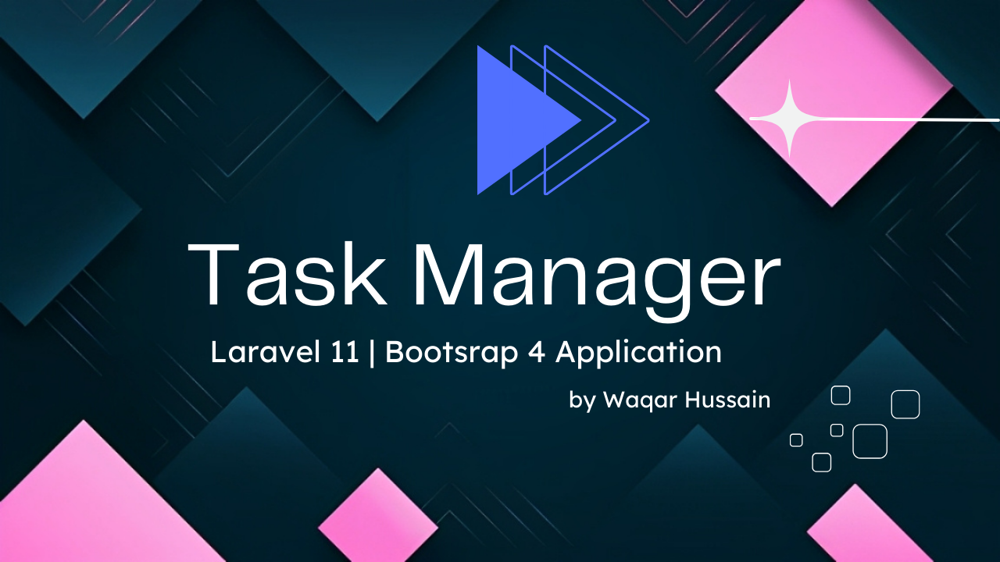

# Laravel Task Manager

A simple task management application built with Laravel and Bootstrap 4.

## Demo Video
Check out the application in action:

## Features

- Create, read, update, and delete tasks
- Mark tasks as completed or pending
- Search tasks by title or status
- Drag and drop task reordering
- Pagination for task lists
- Bootstrap 4 UI components
- Form validation
- Confirmation modals for deletions

## Setup Instructions

1. Clone the repository
2. Run `composer install`
3. Copy `.env.example` to `.env` and configure your database
4. Run `php artisan key:generate`
5. Run `php artisan migrate`
6. Run `php artisan serve`
7. Visit `http://localhost:8000` in your browser

## Bonus Features Implemented

- Search functionality for tasks
- Pagination for task lists
- Drag and drop reordering of tasks
